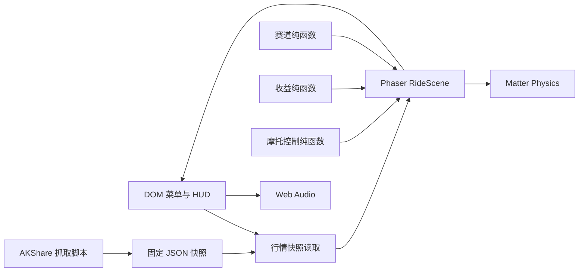

# 架构说明

## 决策

- 使用 Vite、TypeScript、Phaser Matter Physics，避免为单场景游戏引入 React 状态层。
- DOM 管理表单和可访问文本，Canvas 管理高频物理与渲染。
- 行情只在构建期抓取。运行时静态化保证可复现、可离线部署和接口故障隔离。
- 视觉资源和音效程序化生成，减少首屏网络请求并保持项目自包含。
- Phaser 游戏包在点击开始后动态加载，首页和选股页无需提前下载物理引擎。
- `bikeControl.ts` 统一计算油门、扭矩曲线、制动、倒车与姿态扭矩；`RideScene` 只提供输入和物理状态并应用输出。
- 车辆使用非碰撞组和车轮销约束，车架质量高于车轮；Matter 增加约束解算迭代以稳定坡面接触。
- 摔车由 `RideScene` 在原有刚体上执行位置、角度、速度和碰撞状态复位，不重建场景，因此余额和结算状态不会丢失。
- 高频 HUD 仍由场景状态回调驱动；金币结算动画在 DOM 层短暂接管金额显示，动画结束后恢复实时 HUD 更新。
- 详细取舍见 `docs/adr/0001-hybrid-rear-wheel-controller.md`。
